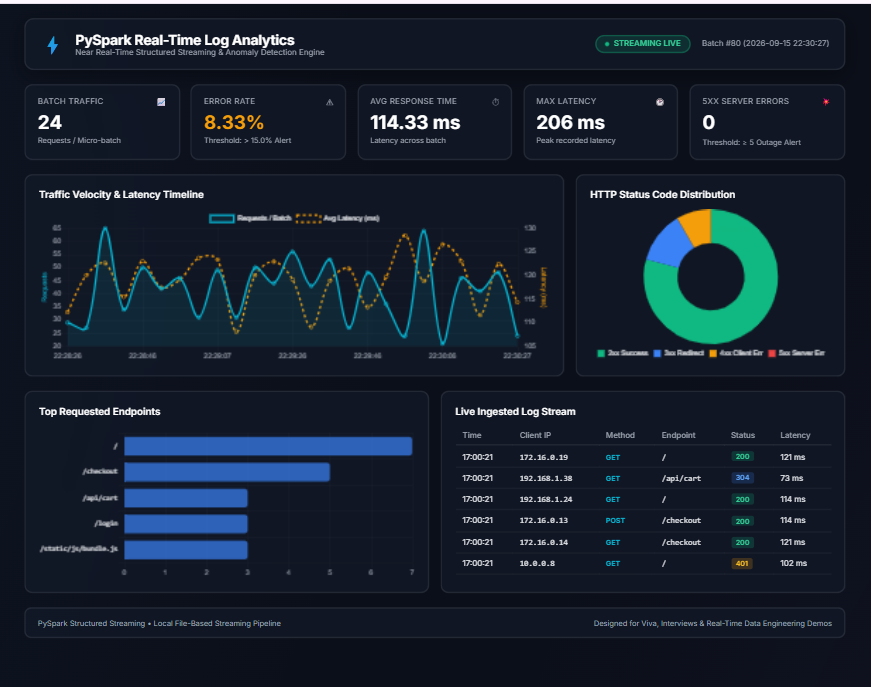
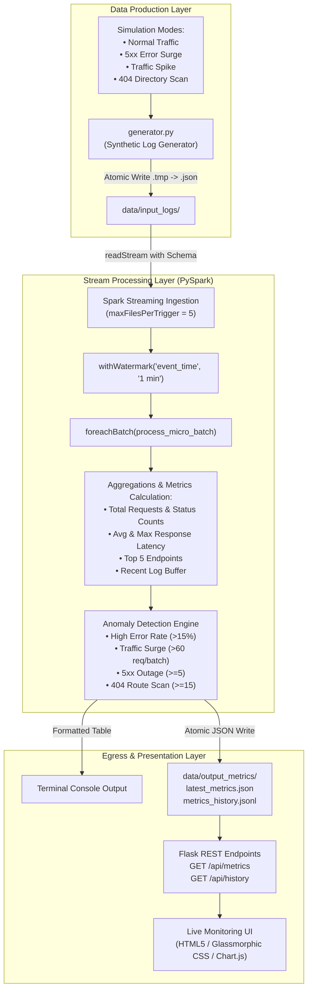

# ⚡ Real-Time PySpark Log Analytics & Anomaly Detection Engine

[](https://www.python.org/)
[](https://spark.apache.org/)
[](https://spark.apache.org/docs/latest/api/python/)
[](https://flask.palletsprojects.com/)
[](https://www.chartjs.org/)
[](LICENSE)
[]()

> A production-grade, end-to-end **Real-Time Data Streaming & Observability Pipeline** built with **PySpark Structured Streaming**, **Python**, and a **Glassmorphic Real-Time Web Dashboard**. Designed for demonstration, technical interviews, viva evaluations, and portfolio showcases.

---

## 📸 Live Dashboard Preview

Below is a live snapshot of the monitoring dashboard actively processing streaming micro-batches (`Batch #80` shown), tracking latency fluctuations, categorizing HTTP status codes, ranking hot endpoints, and inspecting raw log events:

<p align="center">
  
</p>

---

## 📌 Executive Summary

Modern web applications generate massive volumes of distributed access logs every second. Detecting service degradations, cascading 5xx outages, distributed denial-of-service (DDoS) flash traffic, and malicious directory scanning cannot wait for traditional end-of-day batch ETL jobs.

This project implements an end-to-end, sub-second **Stream Processing Architecture** that:
1. **Generates** high-throughput, realistic web access logs across dynamic operational scenarios (normal operations, server outages, traffic surges, and security scans).
2. **Ingests & Processes** incoming streams incrementally using **PySpark Structured Streaming** with schema validation and event-time watermarking.
3. **Calculates Streaming Aggregations** across rolling sliding windows (traffic velocity, error rates, average and peak latency percentiles, endpoint hit distributions).
4. **Detects Operational Anomalies** using a configurable rule-based engine in sub-second micro-batches.
5. **Visualizes Operational Telemetry** on a dark glassmorphic web dashboard with live dual-axis charts, doughnut distributions, endpoint rankings, and log inspection tables.

---

## 🏗️ System Architecture

```
+---------------------------------------------------------------------------------------+
|                                SYNTHETIC LOG GENERATOR                                |
|                                    (generator.py)                                     |
|  - Generates realistic JSON log records (IP, Method, Endpoint, Status, Latency, UA)   |
|  - Simulates 4 dynamic modes: Normal, Error Spike (5xx), Traffic Flood, 404 Scan      |
|  - Uses Atomic Write Protocol (.tmp -> atomic file rename) to prevent race conditions |
+-------------------------------------------+-------------------------------------------+
                                            | Writes JSON micro-batches (every 2 sec)
                                            v
+---------------------------------------------------------------------------------------+
|                             FILE STREAM INGESTION SPOOL                               |
|                                 (data/input_logs/*.json)                              |
+-------------------------------------------+-------------------------------------------+
                                            | PySpark readStream (maxFilesPerTrigger: 5)
                                            v
+---------------------------------------------------------------------------------------+
|                         PYSPARK STRUCTURED STREAMING ENGINE                           |
|                                 (streaming_job.py)                                    |
|  - Explicit StructType schema enforcement (Strict typing, no inferSchema overhead)    |
|  - Event-Time Timestamping: withWatermark("event_time", "1 minute")                   |
|  - Micro-batch processing via foreachBatch sink trigger(processingTime="5s")         |
|  - Windowed aggregations: HTTP 2xx/3xx/4xx/5xx counts, avg/max latency, top endpoints|
|  - Fault tolerance & offset tracking via data/checkpoints                             |
+---------------------+-------------------------------------------+---------------------+
                      |                                           |
                      v                                           v
+-------------------------------------------+  +----------------------------------------+
|          CONSOLE STREAMING SINK           |  |        JSON METRICS PERSISTENCE        |
|  - Terminal micro-batch summary tables    |  |     (data/output_metrics/latest.json   |
|  - Colorized active anomaly alert badges  |  |      data/output_metrics/history.jsonl)|
+-------------------------------------------+  +-------------------+--------------------+
                                                                   | Atomic JSON snapshot
                                                                   v
+---------------------------------------------------------------------------------------+
|                               REAL-TIME WEB DASHBOARD                                 |
|                         (Flask Server @ http://127.0.0.1:5000)                        |
|  - Dual-Axis Traffic Velocity & Latency Timeline Chart (Chart.js)                     |
|  - HTTP Status Code Ratio Doughnut Chart (2xx, 3xx, 4xx, 5xx)                         |
|  - Top 5 Requested Endpoints Frequency Bar Chart                                      |
|  - Live Ingested Log Stream Table (Real-time feed with colored status pills)           |
|  - Flashing Rule-Based Anomaly Alert Banner (CRITICAL / WARNING / HEALTHY)            |
+---------------------------------------------------------------------------------------+
```

### Flowchart Representation (Mermaid)



---

## 📊 Dashboard & Output Analysis

The dashboard displays 5 key telemetry domains updated every 2 seconds:

| Dashboard Widget | Visual Type | Data Metric Represented | Operational Significance |
|---|---|---|---|
| **Batch Traffic** | KPI Card | Number of requests ingested in current micro-batch | Measures instantaneous throughput and workload velocity. |
| **Error Rate** | KPI Card | Percentage of non-2xx/3xx responses `(4xx + 5xx) / Total` | Immediate health index; values $> 15\%$ trigger warnings. |
| **Avg Response Time** | KPI Card | Rolling mean response time in milliseconds (`avg_response_time_ms`) | Tracks end-user latency SLA degradation. |
| **Max Latency** | KPI Card | Peak recorded latency in current batch (`max_response_time_ms`) | Highlights tail latency (p99/p100 anomalies). |
| **5xx Server Errors** | KPI Card | Absolute count of HTTP 500, 503, and 504 status codes | Signals critical backend or database outages. |
| **Traffic Velocity & Latency Timeline** | Dual-Axis Line Chart | Cyan Line: Requests/Batch<br/>Amber Dashed: Latency (ms) | Correlates whether traffic bursts cause latency spikes. |
| **HTTP Status Distribution** | Doughnut Chart | Green (2xx), Blue (3xx), Orange (4xx), Red (5xx) | High-level status distribution across recent traffic. |
| **Top Requested Endpoints** | Horizontal Bar Chart | Request count sorted by endpoint (`/`, `/checkout`, etc.) | Identifies hottest application routes and load hotspots. |
| **Live Ingested Log Stream** | Tabular Stream | Time, Client IP, HTTP Method, Endpoint, Status, Latency | Enables immediate inspection of raw log events. |

---

## 🚨 Anomaly Detection Rules & Severity Matrix

Configured centrally in `config.py`, evaluated within `streaming_job.py`:

| Anomaly Rule | Trigger Condition | Severity | Root Cause & Diagnosis |
|---|---|---|---|
| **`HIGH_ERROR_RATE`** | `(4xx + 5xx) / total >= 15.0%` | `WARNING` ($\ge 15\%$) / `CRITICAL` ($\ge 30\%$) | Client auth failures, corrupted builds, broken microservices. |
| **`TRAFFIC_SPIKE`** | `total_requests >= 60 / batch` | `WARNING` | Flash crowd, marketing campaign launch, or Layer 7 HTTP flood. |
| **`SERVER_OUTAGE_5XX`** | `count(5xx) >= 5 / batch` | `CRITICAL` | Upstream database lockups, unhandled exceptions, gateway timeouts. |
| **`VULNERABILITY_SCAN_404`** | `count(404) >= 15 / batch` | `WARNING` | Automated exploit bots probing for `.env`, `wp-login.php`, or admin URLs. |

---

## 🧪 Simulation Modes

The synthetic generator (`generator.py`) supports 4 distinct simulation modes to test streaming behavior and trigger alert states on demand:

```bash
# 1. Normal Traffic: Realistic distribution (70% 200 OK, normal ~120ms latency)
python generator.py --mode normal

# 2. Server Outage: Massive 500/503 error injection with elevated latency (~1800ms)
python generator.py --mode error-spike

# 3. Traffic Surge: Sudden burst of 80-140 requests per batch with rate limiting (429s)
python generator.py --mode traffic-spike

# 4. Vulnerability Scan: Probes sensitive endpoints (/.env, /admin.php, /.git/config)
python generator.py --mode 404-scan
```

---

## 💻 Tech Stack & Dependencies

- **Distributed Stream Processing**: [Apache Spark 3.x / 4.x](https://spark.apache.org/) (`pyspark`)
- **Backend Server & REST API**: [Flask](https://flask.palletsprojects.com/) (Python 3.10)
- **Frontend Visualization**: Modern HTML5, Vanilla CSS3 (Custom Glassmorphic Dark Theme), [Chart.js 4.4](https://www.chartjs.org/)
- **Native OS Layer**: Windows Hadoop 3.x Native Binaries (`winutils.exe`, `hadoop.dll`)
- **Fault-Tolerance**: Spark Checkpointing (Write-Ahead Log, Offsets, State Store)

---

## 📁 Project Directory Structure

```
Pyspark_Project/
├── config.py                 # Central configurations (paths, streaming windows, anomaly thresholds)
├── generator.py              # Realistic multi-scenario web log generator (atomic JSON writer)
├── streaming_job.py          # PySpark Structured Streaming pipeline & rule-based anomaly engine
├── dashboard_server.py       # Flask web server exposing /api/metrics and /api/history
├── run_pipeline.py           # Master runner to orchestrate all services concurrently
├── verify_pipeline.py        # Automated end-to-end integration and sanity test
├── templates/
│   └── index.html            # Dashboard HTML structure
├── static/
│   ├── css/
│   │   └── style.css         # Glassmorphism dark-mode styling with responsive flex/grid
│   └── js/
│       └── app.js            # Real-time polling, Chart.js managers, and DOM updates
├── hadoop/bin/               # Native Windows Hadoop helper binaries (winutils.exe, hadoop.dll)
├── docs/images/
│   └── dashboard_preview.png # Live dashboard visual preview
├── data/                     # Ephemeral runtime data (git-ignored)
│   ├── input_logs/           # Streaming newline-delimited JSON log files
│   ├── output_metrics/       # latest_metrics.json snapshot & metrics_history.jsonl
│   └── checkpoints/          # Structured streaming offset logs and state store
├── README.md                 # Complete project guide and architecture documentation
└── INTERVIEW_PREP.md         # In-depth technical interview & viva cheat-sheet
```

---

## 🚀 Getting Started

### 1. Prerequisites
- **Python**: Version 3.8 to 3.11 installed.
- **Java**: Java 8, 11, or 17 (JDK or JRE) installed and available on system `PATH` (Verify via `java -version`).
- **Dependencies**: Install the required Python packages:
  ```bash
  pip install pyspark flask
  ```

> **Note for Windows Users**: This repository already includes pre-configured Windows Hadoop binaries (`hadoop/bin/winutils.exe` and `hadoop/bin/hadoop.dll`). `config.py` automatically sets `HADOOP_HOME` and updates your process `PATH` dynamically. No manual Windows configuration is needed.

---

### 2. Running the Complete System (One-Click Runner)

Launch all 3 components simultaneously (Dashboard, Spark Streaming Engine, and Log Generator) with automatic process supervision:

```bash
python run_pipeline.py
```

Once running:
- Open your web browser to **`http://127.0.0.1:5000`** to view the live dashboard.
- Watch your terminal for live Spark micro-batch progress tables and color-coded alert notifications.
- Press `Ctrl + C` in the terminal to gracefully terminate all child processes.

---

### 3. Running Components Individually (Granular Mode)

If you prefer to observe each service in its own dedicated terminal window:

#### Terminal 1 — Start the Web Dashboard
```bash
python dashboard_server.py
```
*Accessible at `http://127.0.0.1:5000`.*

#### Terminal 2 — Start the PySpark Streaming Engine
```bash
python streaming_job.py
```
*Initializes the SparkSession, sets up schema enforcement, attaches watermarks, and monitors `data/input_logs/`.*

#### Terminal 3 — Start the Synthetic Traffic Generator
```bash
# Start standard traffic flow
python generator.py

# Or test an anomaly scenario:
python generator.py --mode error-spike
```

---

### 4. Running the Automated Verification Test

To verify that the log generator, PySpark DataFrame APIs, micro-batch processing, anomaly alerts, and JSON sinks work seamlessly together without running the long-lived stream, execute:

```bash
python verify_pipeline.py
```

Expected output:
```text
============================================================
  RUNNING PIPELINE VERIFICATION TEST
============================================================
[1] Generating test log files...
    - Generated 19 normal logs -> .../logs_..._991.json
    - Generated 22 error-spike logs -> .../logs_..._992.json

[2] Initializing PySpark local session...
    - SparkSession initialized successfully!

[3] Testing Micro-Batch Processing...
    - Total records in input directory: 41

======================================================================
 [SPARK STREAMING] BATCH #0001 | 2026-09-16 14:30:00
======================================================================
 Requests:   41 | Avg Latency:  882.4ms | Max: 2105ms
 Status  : 2xx=14 | 3xx=2 | 4xx=1 | 5xx=24
 Health  : Error Rate = 60.98% [ALERT: CRITICAL]
----------------------------------------------------------------------
 >> ACTIVE ALERTS TRIGGERED <<
    [CRITICAL] HIGH_ERROR_RATE: Elevated error rate detected (60.9% errors).
    [CRITICAL] SERVER_OUTAGE_5XX: Backend microservices returning 5xx errors (24 occurrences).
======================================================================

[4] Validating Generated Metrics Snapshot:
    - Batch ID         : 1
    - Total Requests   : 41
    - Error Rate %     : 60.98%
    - Avg Latency (ms) : 882.4 ms
    - Status 5xx       : 24
    - Active Alerts    : 2 alerts triggered
============================================================
  VERIFICATION COMPLETE: ALL CHECKS PASSED!
============================================================
```

---

## 📖 Technical Deep Dive (For Your Reading Sake & Interview Viva)

This section details the critical architectural decisions and PySpark Structured Streaming internals implemented in this project.

### 1. Structured Streaming vs Legacy DStreams
Legacy Spark Streaming (DStreams) operated on RDDs and processed data based strictly on **processing time** (when the cluster received the batch), making event-time handling and late-data recovery cumbersome.  
**Structured Streaming** unifies batch and streaming queries under the **Catalyst Optimizer** and Spark SQL DataFrame engine. It evaluates computations using **event time** (the actual timestamp when the user hit the web server), allowing accurate calculations even if records arrive delayed due to network lag.

### 2. Event-Time Watermarking & Memory Management
In streaming aggregations, retaining state in memory indefinitely causes an eventual `OutOfMemoryError` (OOM).  
Watermarking defines the boundary for how late data is permitted to arrive:
$$\text{Watermark} = \max(\text{Event Time Seen}) - \text{Allowed Latency}$$
In `streaming_job.py`:
```python
parsed_stream = raw_stream \
    .withColumn("event_time", to_timestamp(col("timestamp"), "yyyy-MM-dd HH:mm:ss")) \
    .withWatermark("event_time", "1 minute")
```
When the watermark passes beyond the end time of an aggregation window, Spark finalizes the state and evicts old data from memory.

### 3. Why `foreachBatch` Sink?
Standard built-in streaming sinks (e.g., `file`, `console`, `kafka`) are single-purpose and do not allow multiple heterogeneous outputs. By utilizing `foreachBatch`:
```python
query = parsed_stream.writeStream \
    .trigger(processingTime="5 seconds") \
    .option("checkpointLocation", config.CHECKPOINT_DIR) \
    .foreachBatch(process_micro_batch) \
    .start()
```
We achieve:
- Simultaneous emission of formatted summaries to the CLI console.
- Execution of rule-based anomaly detection logic directly on the batch DataFrame.
- Atomic export of a lightweight snapshot (`latest_metrics.json`) for the web dashboard.
- Appending historical trends to `metrics_history.jsonl`.

### 4. Preventing Stream Reading Race Conditions (Atomic Writes)
When streaming engines monitor a filesystem directory, reading a file that is currently being written causes a `MalformedLineException` or incomplete reads.  
In `generator.py`, we implement the **Atomic File Write Protocol**:
```python
temp_filepath = os.path.join(INPUT_LOGS_DIR, f"{filename}.tmp")
final_filepath = os.path.join(INPUT_LOGS_DIR, filename)

with open(temp_filepath, "w", encoding="utf-8") as f:
    for log_entry in logs:
        f.write(json.dumps(log_entry) + "\n")

# Atomic rename within the same filesystem
os.replace(temp_filepath, final_filepath)
```
Spark's file stream only picks up files that have been completely written and committed.

### 5. Shuffle Partition Tuning for Low-Latency Streaming
By default, Apache Spark sets `spark.sql.shuffle.partitions = 200`. While optimal for distributed clusters processing terabytes of data, in a local streaming pipeline processing small micro-batches, 200 partitions cause excessive JVM task scheduling overhead and thread contention.  
We tune this in `streaming_job.py`:
```python
SparkSession.builder \
    .config("spark.sql.shuffle.partitions", "2") \
    .master("local[2]")
```
This optimization reduces micro-batch execution latency from several seconds down to ~150-200ms.

### 6. Resolving Windows Hadoop `NativeIO` Dependencies
On Windows, Hadoop depends on native C++ libraries (`winutils.exe` and `hadoop.dll`) to interface with the Windows File Security API. Without these, PySpark fails with `UnsatisfiedLinkError: NativeIO$Windows.access0`.  
This project includes pre-compiled, tested Hadoop 3.x native binaries in `hadoop/bin/` and configures them automatically in `config.py`:
```python
if os.name == "nt" and os.path.exists(HADOOP_BIN):
    os.environ["HADOOP_HOME"] = HADOOP_DIR
    os.environ["PATH"] = HADOOP_BIN + os.pathsep + os.environ.get("PATH", "")
```

---

## 🌐 REST API Documentation

The lightweight Flask server (`dashboard_server.py`) provides two REST endpoints consumed by the front-end dashboard:

### 1. `GET /api/metrics`
Returns the latest streaming micro-batch summary snapshot.

**Sample Response:**
```json
{
  "batch_id": 80,
  "timestamp": "2026-09-15 22:30:27",
  "total_requests": 24,
  "error_rate_pct": 8.33,
  "avg_response_time_ms": 114.33,
  "max_response_time_ms": 206,
  "status_2xx": 20,
  "status_3xx": 2,
  "status_4xx": 2,
  "status_5xx": 0,
  "status_404": 0,
  "status": "HEALTHY",
  "alerts": [],
  "top_endpoints": [
    { "endpoint": "/", "hits": 7, "avg_latency_ms": 105.4 },
    { "endpoint": "/checkout", "hits": 5, "avg_latency_ms": 142.1 },
    { "endpoint": "/api/cart", "hits": 3, "avg_latency_ms": 118.0 }
  ]
}
```

### 2. `GET /api/history`
Returns a sliding list of the last 25 micro-batch metrics used to plot the live dual-axis traffic timeline chart.

---

## 📈 Enterprise Production Scaling Roadmap

To transition this standalone streaming engine into a petabyte-scale enterprise deployment:

```
[Web Servers / Microservices]
            │
            ▼ (JSON Access Logs)
[Log Ingestion Agents: Fluentbit / Logstash]
            │
            ▼
[Distributed Event Broker: Apache Kafka / AWS Kinesis]
  - Multi-partitioned topics (partition by host or client ID)
            │
            ▼ (Kafka Source Stream)
[PySpark on Kubernetes / Databricks / AWS EMR]
  - Structured Streaming with Auto-scaling Executor Nodes
  - RocksDB State Store for massive watermarked state
            │
            ├──► [Lakehouse Storage: Delta Lake / Apache Iceberg / S3] (Bronze/Silver/Gold)
            ├──► [Real-Time OLAP: ClickHouse / Apache Pinot] (Sub-second querying)
            └──► [Alert Egress: PagerDuty / Slack Webhooks / Prometheus Pushgateway]
```

1. **Ingestion Layer**: Replace local file ingestion with **Apache Kafka** (`spark.readStream.format("kafka")`).
2. **State Management**: Upgrade from the default memory state store to the **RocksDB State Store Provider** to support gigabyte-scale watermarked windows without RAM exhaustion.
3. **Storage Tier**: Write raw batches directly into **Delta Lake** or **Apache Iceberg** tables to enable ACID transactions, time travel, and unified streaming + batch historical analytics.
4. **Alerting & Sinks**: Forward triggered anomalies directly to **PagerDuty**, **Slack**, or **Prometheus Alertmanager** via webhook integrations in `process_micro_batch`.

---

## 📜 License

This project is open-source and distributed under the [MIT License](LICENSE). Feel free to adapt, extend, and showcase in your own projects or academic presentations.

---

## 🤝 Acknowledgments & Reference Material

- [Apache Spark Structured Streaming Programming Guide](https://spark.apache.org/docs/latest/structured-streaming-programming-guide.html)
- [PySpark Documentation](https://spark.apache.org/docs/latest/api/python/)
- [Chart.js Documentation](https://www.chartjs.org/docs/latest/)
- Detailed Viva & Interview Q&A available in [`INTERVIEW_PREP.md`](INTERVIEW_PREP.md)
